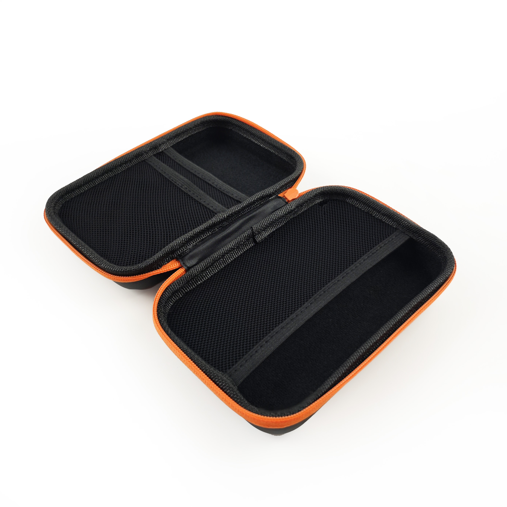
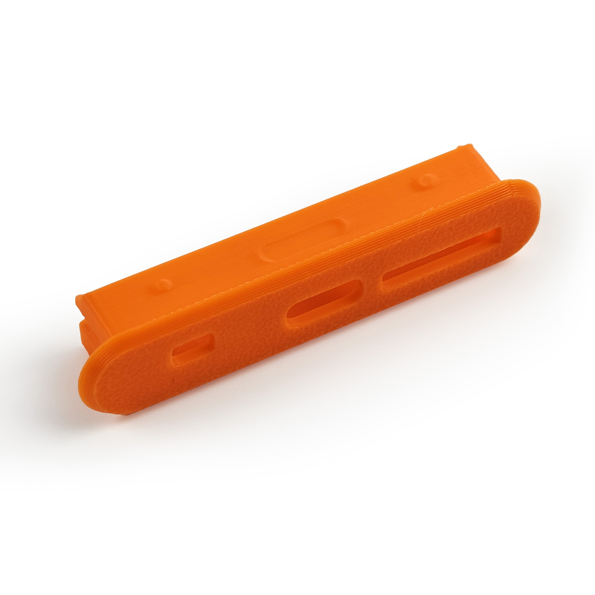

# 配件

在这里，您可以找到各种增强 Openterface Mini-KVM 功能的产品。我们致力于提供一系列配件，使您使用 Mini-KVM 的体验更加多样化和便捷。

## VGA 转 HDMI 转换线

{:style="height:360px"}

此产品将 VGA 视频和音频整合到 HDMI 中，方便将 VGA 设备连接到 HDMI 显示器。

- **型号**: CABLE100-VGA2HDMI
- **长度**: 1米
- **输出视频分辨率**: 1920x1080P 全高清
- **输入音频**: 3.5mm 音频插孔
- **音频输出**: 通过 HDMI
- **电源供应**: 通过 USB 供电

### 使用案例
有关此线缆的详细使用案例，请访问 [简化的服务器管理](/use-cases/#streamlined-server-management)。

### 演示视频
观看科技影响者 **Cameron Gray** 演示如何使用此线缆与 Mini-KVM: [这个 USB KVM 控制台太棒了！](https://youtu.be/xAEQpWyfY-c?si=auB5NtqHVw2C7iIK&t=1693)

<button class="md-button" onclick="window.location.href='https://www.crowdsupply.com/techxartisan/openterface-mini-kvm#products'">下单</button>

---

## Type-C 转 USB-A 线缆及适配器

{:style="height:360px"}

这款多功能 Type-C 公对 USB-A 公线缆，配有 USB-A 母对 USB-C 公适配器，提供灵活的目标设备连接。无论目标设备使用 USB-A 还是 Type-C 接口，它都能实现数据传输和键盘鼠标控制信号的传输。

- **长度**: 0.3米
- **颜色**: 黑色
- **适配器**: USB-A 母对 USB-C 公
- **用途**: 便于控制和数据传输到目标设备。

---

## Type-C 对 Type-C 线缆及适配器

{:style="height:360px"}

这款时尚且手感柔软的 Type-C 公对公线缆，采用亮橙色设计，适用于主机连接。配有 USB-C 母对 USB-A 公适配器，确保您可以连接使用 Type-C 或 USB-A 接口的主机。此外，此线缆支持 **240W 快速充电**（电压 DC50V，电流 5A，功率 240W），不仅适用于我们的 Mini-KVM，还适用于为手机或笔记本电脑快速充电。

- **长度**: 1.5米
- **颜色**: 橙色
- **适配器**: USB-C 母对 USB-A 公
- **用途**: 用于主机与 Mini-KVM 之间的高速数据传输，以及为手机或笔记本电脑快速充电。

---

## HDMI 公对公线缆

{:style="height:360px"}

这款紧凑的 HDMI 线缆非常适合将目标设备连接到 Mini-KVM，以捕获视频输出，确保与 Openterface Mini-KVM 的无缝集成。

- **长度**: 0.3米
- **颜色**: 黑色
- **用途**: 适用于从目标设备到 Mini-KVM 的高清晰度视频传输。

---

## Openterface 工具包

{:style="height:360px"}

使用这个紧凑的工具包，保持您的 Openterface Mini-KVM 及其配件整齐有序。配有时尚的橙色拉链和弹性网袋，这个包确保了出色的线缆管理和便携性，非常适合外出工作的 IT 专业人士。

- **尺寸**: 180 x 115 x 50毫米
- **颜色**: 黑色配橙色拉链
- **用途**: 适用于存放和整理您的 Mini-KVM 及其线缆。

---

## 扩展针帽

{:style="height:360px"}

这个 3D 打印的扩展针帽替换了 Openterface Mini-KVM 的原始针帽，允许高级用户暴露和访问扩展针进行自定义开发。您可以从我们的 GitHub 仓库下载 3D 模型文件并自行打印针帽。

- **用途**: 提供访问扩展针的功能，适用于高级硬件开发。
- **下载**: [3D 模型文件](https://github.com/TechxArtisanStudio/Openterface_Mini-KVM_Hardware/tree/main/models)

---

## 更多即将推出

敬请期待更多将添加到此部分的配件，旨在增强您的 Openterface Mini-KVM 体验。