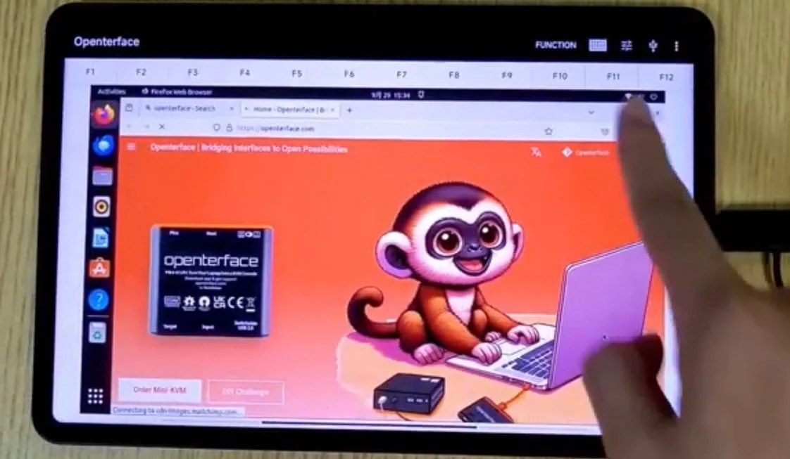

# DIY挑战、酷炫奖品和生产接近尾声！

嗨，Openterface的爱好者们！

我们有一些令人兴奋的消息要分享！从激动人心的新DIY挑战到生产里程碑和酷炫的软件更新—— Openterface这里一片繁忙。拿上一杯饮料，让自己舒适地坐下，和我们一起深入了解这个更新吧！

## 2024年USB KVM DIY挑战：释放你内心的科技巫师！

所有的修补匠、制造者和梦想家们注意了！我们很高兴地宣布2024年USB KVM DIY挑战，这是与TechxArtisan、Make:杂志、开源硬件协会（OSHWA）和Crowd Supply的合作。这是你创造一个定制KVM解决方案的机会——让我们看看你能用Openterface Mini-KVM创造出什么魔法！

### 具体情况如下：

**任务：** 使用Openterface Mini-KVM创建你自己的开放KVM解决方案，并根据你的具体需求进行个性化调整。

**类别：** 顶尖表演者将获得技术技能和创造力奖项，所以每个人都有机会！

**酷炫奖品：**

- 限量版透明和银色外壳的Openterface Mini-KVM。 
- HackerGadgets的未来派Pi-Cast KVM。 
- Clockwork的复古风格GameShell。

**时间表：** 挑战于2024年10月1日开始，提交截止日期为2025年2月28日。

**评委：** 来自TechxArtisan、Make:杂志、OSHWA和Crowd Supply的专家将评估你的项目。

无论你是经验丰富的科技巫师还是刚刚踏入硬件黑客世界，这个比赛都是你的游乐场。谁知道呢？你可能会创造出下一个科技大事件！

加入[Crowd Supply的官方比赛页面](https://www.crowdsupply.com/techxartisan/usb-kvm-diy-challenge-2024)的行动，并在[比赛Discord频道](https://discord.com/invite/YhKVzDujkT)与我们聊天。**让创新游戏开始吧！**

<small><em>Openterface Mini-KVM有三种酷炫外壳——透明、银色和黑色</em></small>

<small><em>一些很棒的奖品：HackerGadgets的Pi-Cast KVM和Clockwork的GameShell</em></small>

## 生产更新：快完成了！

这里是幕后辛勤工作的一个小预览——我们的工作室像蜂巢一样忙碌！到目前为止，我们已经组装了800台Openterface Mini-KVM。

我们的质量控制是一流的。每个单元都经过我们的团队检查、复查和精心呵护，以确保当它到达你手中时，不仅仅是好——而是非常好！我们追求的是让其他设备羡慕的质量。

我们知道等待可能很难，但我们致力于提供最好的体验。感谢你的耐心等待，我们正在进行最后的润色！

## 软件更新：Android应用获得了不错的升级

我们的Android应用刚刚进行了重大升级。现在，通过手机或平板电脑控制你的目标设备从未如此简单和有趣！

在这里查看演示视频：[Android App Demo Video](https://x.com/TechxArtisan/status/1840587612148699398)

### 新功能如下：
- 流畅且响应迅速的触控
- 简单的拖放功能
- 精确的点击，带来直观的体验
- 新的功能键栏，增加了便利性
- 即将推出的功能：可自定义的键盘快捷键
- 兼容Android平板电脑和手机

这个应用程序使Openterface Mini-KVM对移动中的技术专业人员更加有用。我们还将最新的APK和源代码上传到我们的GitHub仓库，如果你想进一步探索或贡献！

## 总结

呼！这真是一个相当大的更新，对吧？

如果你有任何想法、反馈或疯狂的KVM梦想，我们想听到它们！给我们发私信，发送信鸽🕊️，或加入我们的社区频道。我们喜欢与你们联系！

再次感谢你的耐心和成为最棒的科技社区。我们还有更多令人兴奋的新闻和更新即将到来——敬请期待！

感激不尽，  
Billy Wang  
产品经理  
Openterface团队 | TechxArtisan

