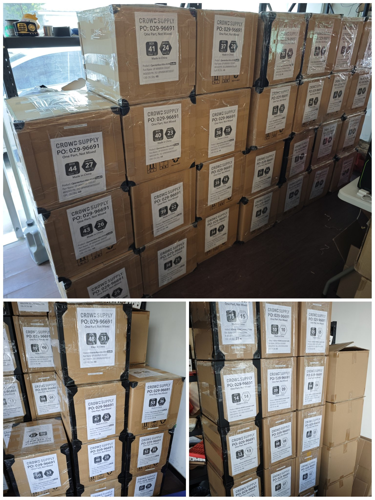
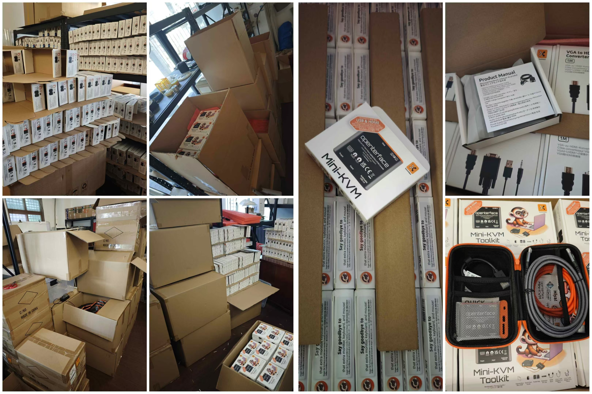

# 产品已发货！工具包新增额外电缆，接下来是什么？

大家好，Openterface 社区！

我们很高兴地宣布，我们的 Openterface 产品已经正式发货。它们目前在深圳的港口，准备登上一艘前往美国的货船！

  

以下是最新动态：

## 发货准备：质量检查与包装

在包装和发货之前，我们对每一台设备进行了全面的测试，确保其质量达到最高标准，正如我们在之前的更新中提到的：[DIY 挑战、酷炫奖品与生产接近尾声！](https://www.crowdsupply.com/techxartisan/openterface-mini-kvm/updates/diy-challenge-cool-prizes-and-production-nears-the-finish-line)。每根电缆都经过了信号传输稳定性检查，使用的是我们的 Mini-KVM。

现在，让我们谈谈最新的消息——既有不好的，也有好的。

### 不好的消息：一些橙色电缆在恶劣环境下未达到预期

我们的 Mini-KVM 通过一根 Type-C 电缆传输视频、音频、鼠标/键盘控制和 USB 数据。电缆的性能对数据的稳定性至关重要，特别是在复杂环境中。

为了模拟现实世界中的干扰，我们将橙色的 Type-C 电缆绕在一个电风扇电机周围，同时附近运行多个计算机。这种设置产生了较高的电磁干扰（EMI），以评估电缆的信号传输稳定性。

  
*一种经济实惠且有效的测试方法。*

请查看我们的[推特视频](https://x.com/TechxArtisan/status/1856559677296816347)，观看我们的测试表现比较。

在这些条件下，一些橙色电缆出现了信号丢失，这引发了对它们在数据中心或关键 IT 操作等复杂环境中可靠性的担忧。

为了解决这个问题，我们的技术总监 Kevin Peng 开发了一款定制的测试程序。这个工具可以让您自己测试 USB 电缆的质量，并将在未来开放源代码，届时会有更多更新。

  
*我们的程序使电缆测试变得轻松。*

虽然我们的橙色电缆外观吸引，且具有柔软的硅胶质感，非常适合日常使用，如快速充电和常规数据传输，但它们在高 EMI 等恶劣环境下的表现不足，无法应对大数据量的传输。

### 好消息：解决方案已到位

我们已经立即采购了高质量的尼龙 USB 3.2 电缆，作为额外配件包含在工具包版本中——**对您没有任何额外费用**。这些耐用的电缆提供三种不同长度，颜色为灰色：*1米（3.2英尺）*、*1.5米（4.9英尺）* 和 *2米（6.5英尺）*。您将随机收到其中一种长度的电缆，确保您的 Mini-KVM 连接稳定可靠。

在未来的 Mini-KVM 工具包版本中，我们连接主机端的橙色电缆将升级为尼龙 Type-C 3.2 电缆，结合了功能性、稳定性与时尚。

我们希望您会欣赏这一决定，并继续在关键时刻依赖 Openterface 的产品。

## 发货时间表

何时能收到您的 Mini-KVM？  
如果一切顺利，我们的产品应当会在 **12月中旬到达 Crowd Supply 的 Mouser 仓库**，之后将按照订单顺序发货。

- **美国的支持者**：有可能在圣诞节前送达，但并不保证，因为随着节日临近，一切都可能变慢。  
- **美国以外的支持者**：发货时间会有所不同，我们的最佳估计是 1 月中旬。

希望我们的 Openterface 产品能够顺利出行——没有晕船、晕车或时差反应！😃

## 酷炫的 Openterface T 恤与卫衣

我们将在本周末（11月16–17日）参加深圳的 Maker Faire。为了做好准备，我们设计了团队服装，包括 T 恤、拉链卫衣和套头卫衣。

请看看，告诉我们您的想法：  

## 支持我们的开发

如果您想进一步支持我们的开源开发，可以访问我们的[TechxArtisan 商店](https://shop.techxartisan.com/)。您可以购买电缆、T 恤和卫衣——同时帮助我们继续创新。每一笔购买都对开源社区精神的支持起到了作用。

## 接下来是什么：主机应用更新

现在发货已经开始，我们的重点将转向完善主机应用。我们正在努力让它们通过各大应用商店的验证，确保您在使用 Openterface 时拥有流畅的体验。

## 接下来是什么：加入我们的 USB DIY 挑战

一旦您收到了 Openterface Mini-KVM，为什么不参加我们的 **USB KVM DIY 挑战 2024** 呢？这是一个为我们的开源开发做贡献并赢取奖品的好机会——包括两台特别版 Openterface Mini-KVM 等！更多详情，请查看 [Crowd Supply 上的竞赛页面](https://www.crowdsupply.com/techxartisan/usb-kvm-diy-challenge-2024)。

  

## 总结

感谢您一直以来的支持，您是我们旅程中不可或缺的一部分。您的反馈与支持让我们不断前行。如果您有任何问题或想法，欢迎与我们联系！加入我们在[Reddit](https://openterface.com/reddit)和[Discord](https://openterface.com/discord)上的社区，共同讨论。

衷心感谢，  
**Billy Wang**  
产品经理  
Openterface 团队 | TechxArtisan
