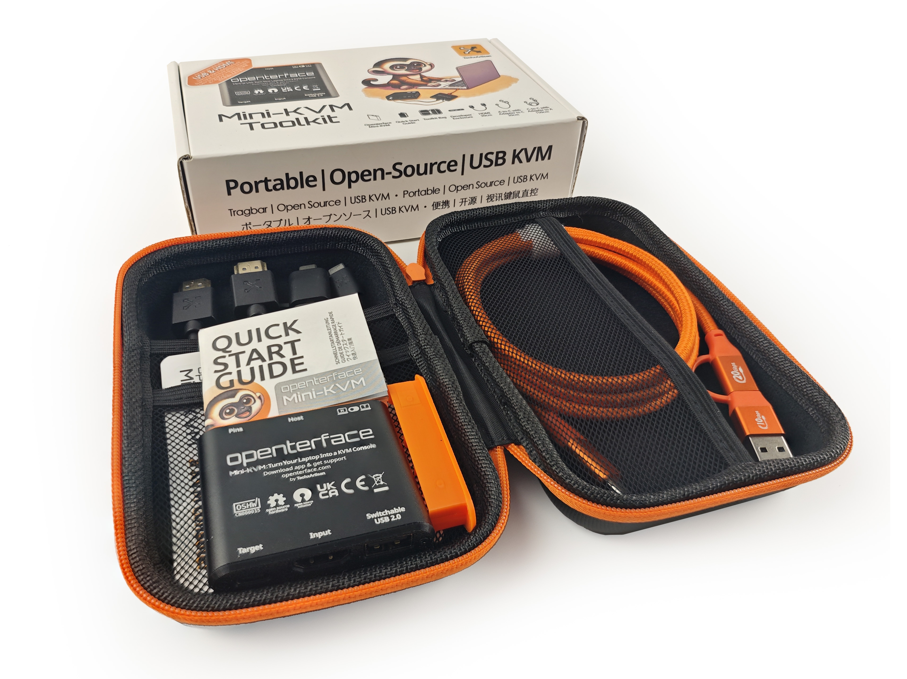

# 清理积压、更新设备和更多时间来构建USB KVM！

**大家好，Openterface大家庭！**

已经有一段时间了，我们有了一些激动人心的消息要分享！让我们开始吧！

### 你们的拆箱，都是我们最大的动力

越来越多的支持者正在收到他们的套件，并在Discord、Reddit、Mastodon、Bluesky、Threads、X等平台上分享他们的拆箱、设置和创造性的用法！我们在这些平台上看到了很多超厉害的拆箱帖子！

老实说，虽然已经多次提到过这点，但我们不得不再说一遍—我们的感激之情非常非常深。感谢家人们！看到你们的热情和我们的设备可以帮助你们在技术前线发挥作用，我们感到深深的自豪，这正是我们为之而建造和战斗的目标，这是一个真正的荣誉。你们的分享和反馈是我们辛勤工作的最大验证。

感谢，Openterface大家庭！ 🚀💙

### **积压清理完毕，库存充足**

根据Crowd Supply的信息，大多数订单已经发货！如果您还没有收到您的订单，请检查您的订单信息，很可能正在处理中，应该很快就会到达。如果有任何问题，请[联系Crowd Supply](https://www.crowdsupply.com/contact)以获取您订单状态的更新。

此外，我们最近又发出了一批Openterface Mini-KVM，Crowd Supply的德克萨斯仓库现在已经库存充足！因此，如果您当前的Mini-KVM对于管理您的无头设备具有价值，那么请考虑[通过Crowd Supply获取再多一个](https://www.crowdsupply.com/techxartisan/openterface-mini-kvm)—又或者向您的技术爱好者朋友们介绍我们的产品哦！

### **有问题？没问题！开发团队在行动**  

在我们的Reddit、Discord和GitHub上，讨论的热度非常高！你们的反馈、咨询和问题报告正在涌入，我们非常感谢这些信息。

以下是我们的开发团队当前的工作重点：

- **修复错误：** 修复你们报告的那些让人不快的缺陷。  
- **支持你们：** 更新我们的文档和FAQ，以使你们的体验更加顺滑。  

我们正在审查每一个问题，定期进行检查，并一个一个地修复错误。使应用程序更加稳定和可靠是我们的首要任务—你们的输入对于实现这一目标至关重要。  

发现了错误报告或Mini-KVM拯救世界的方法？我们**非常想**听到这些！无论是创造性的设置、必须有的功能想法还是单纯地想要分享激动，我们都在听着呢！

为了帮助我们的开发团队系统地跟踪错误（并保持他们的头脑清醒），我们**强烈建议**在我们的GitHub存储库中报告错误：

- [Openterface QT](https://github.com/TechxArtisanStudio/Openterface_QT) for Windows & Linux
- [Openterface MacOS](https://github.com/TechxArtisanStudio/Openterface_MacOS)
- [Openterface Android](https://github.com/TechxArtisanStudio/Openterface_Android)
- [Openterface Mini-KVM Hardware](https://github.com/TechxArtisanStudio/Openterface_Mini-KVM_Hardware)

如果您喜欢与开发团队和其他Openterface粉丝进行实时讨论？加入我们的社区：

- **Reddit:** [r/Openterface_miniKVM](https://openterface.com/reddit)  
- **Discord:** [Openterface](https://openterface.com/discord)  

哦对了，如果您喜欢保持传统，也可以**给我们发邮件**到info@techxartisan.com，或者通过我们的**Google表单**提交反馈：[提交反馈](https://forms.gle/enVJYFGn6gghEFaJ9)。  

你们的耐心和支持对我们来说意义非凡，因为我们正在解决通往成功路上的任何障碍。对所有报告问题、分享想法，甚至贡献代码的人，我们表示巨大的感谢！Openterface设备还不完美（至少现在还不是），但相信我们—有了这个社区的能量，它每天都在变得更好。 🚀💙  

### **DIY KVM挑战赛：延期并升级奖品！**

由于我们的套件比预期晚了一些，我们正在延长DIY KVM挑战赛的期限，增加**两个月**！此外，我们还在升级奖品—请关注Crowd Supply竞赛页面的详细信息。那意味着您有更多时间来摆弄、实验和展示您的作品。立即加入充满乐趣的活动，并通过Crowd Supply的USB DIY竞赛页面提交您的项目：[USB KVM DIY挑战赛2024](https://www.crowdsupply.com/techxartisan/usb-kvm-diy-challenge-2024)

### **全新橙色尼龙电缆**

伴随我们最新的Mini-KVM批次，我们已经正式升级了工具包版本中的Type-C电缆到全新的亮眼橙尼龙电缆。这个新数据线不仅视觉上引人注目—它还为性能而生，具有优越的EMI抗干扰能力、稳定的数据传输和出色的耐用性。

但如果您更喜欢原来的硅胶般柔软、灵活的Type-C电缆，没问题！您可以从我们的[TxA商店](https://shop.techxartisan.com/products/type-c-cable-with-usb-a-adapter-1-5m-4-11ft-240w-fast-charging-data-transfer-usb2-0)中获取它们。两根电缆都有其优势，我们确信新的尼龙版本将是您技术工具箱的实力保障。

### **无缝控制：Mini-KVM + Android Pencil = 纯粹的魔法**

您是否曾经想过，当您[将Mini-KVM与Android Pencil配对](https://www.reddit.com/r/Openterface_miniKVM/comments/1hnh79n/kicad_is_the_fisrt_software_we_tried_first_with/)时会发生什么？纯粹的魔法！从设计草图到导航macOS或Windows，[Opoenterface Android主机应用](https://github.com/TechxArtisanStudio/Openterface_Android)的体验是流畅、直观和满足的！请查看我们的演示视频，看看它的实际操作！

### **社区的精彩实用示范：**

以下只是一些您如何使用Openterface Mini-KVM的想法：

- **使用Android手机进行无头控制：** [My Pi 5 setup: UPS, Aluminium Case, & Openterface Magic](https://www.reddit.com/r/Openterface_miniKVM/comments/1hrx1j5/my_pi_5_setup_ups_aluminium_case_openterface_magic/)
- **复活一台坏掉的MacBook：** [Uh... A way to save the day of this pink screen!](https://www.reddit.com/r/macbookpro/comments/1hwkh64/uh_a_way_to_save_the_day_of_this_pink_screen/)
- **在我们的[网站](https://openterface.com/use-cases/)上探索更多用例**。

你们的创造力和热情是Openterface社区的核心。 

与此同时，请确保探索我们的[TechxArtisan商店](http://shop.techxartisan.com/)，以获取Openterface商品和与Openterface设备无缝工作的高质量数据线。 

那就…祝您愉快地摆弄设备！

感谢，
Billy Wang  
产品经理  
Openterface团队 | TechxArtisan